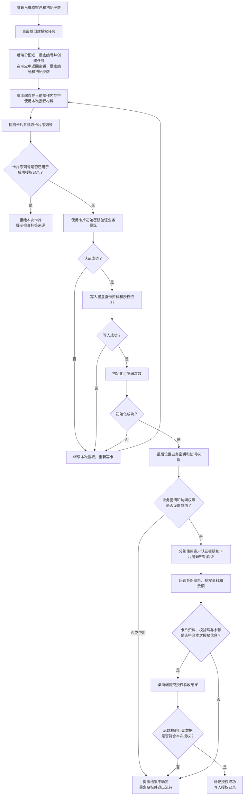
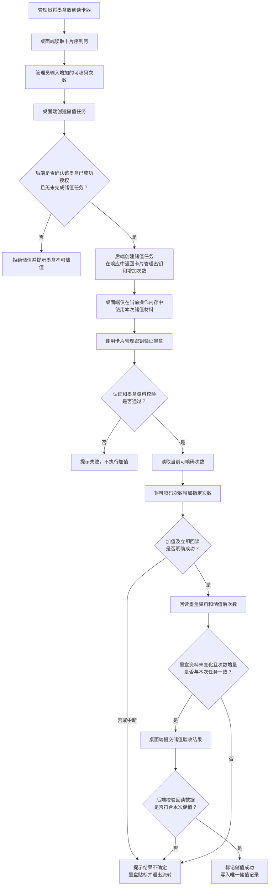
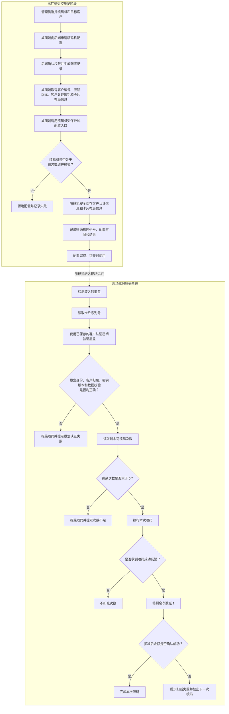

# RFID M1 墨盒授权方案

## 1. 目标与边界

本方案用于 F08 抗金属 M1 卡贴墨盒：出厂时写入独立墨盒编号、客户归属和初始可喷码次数；喷码机在离线状态认证墨盒，余额不足时禁止喷码，并在喷码成功回调后扣减一次。

已确认的边界：

- 设备只在组装/出厂阶段联网配置，运行期间离线。
- 一台喷码机只服务一个客户。
- 每个客户使用一个统一的客户密钥。
- 第一版不实现待扣减流水、补扣或断电恢复。
- 第一版固定使用密钥版本 `1`，不提供密钥版本变更功能；卡内仍保留密钥版本字段。

## 2. 文档依据

| 能力 | 依据 | 方案中的用法 |
| --- | --- | --- |
| F08/M1 存储结构 | `Mifare1+S50IC卡中文说明书.pdf` | 16 个扇区，每扇区 3 个数据块和 1 个扇区尾块；数据块 16 字节。 |
| 扇区认证和访问控制 | `Mifare1+S50IC卡中文说明书.pdf` | 每扇区独立 `Key A`、访问控制位和 `Key B`。 |
| 值块 | `Mifare1+S50IC卡中文说明书.pdf` | 使用值块保存余额，支持初始化、读值、加值和减值。 |
| 读写器通信 | `通用协议规则_v1.0.1.pdf` | 命令使用 `AA` 帧头、递增序号、大端长度及 XOR 校验。 |
| M1 读写操作 | `RFID功能指令_v1.0.38.pdf` | 使用经典卡认证、读、写、初始化值、加值、读值与减值指令。 |

## 3. 子方案拆分与交付边界

实施阶段只拆分为两个子方案。后端接口与密钥服务仍是独立部署的服务，但不单列第三个子方案；其需求按所支持的端侧能力分别纳入两个子方案。

| 子方案 | 范围 | 纳入的后端能力 | 可验收交付物 |
| --- | --- | --- | --- |
| [授权加密桌面端子方案](./RFID_M1授权加密桌面端子方案.md) | 云平台账号登录、客户注册与查询、墨盒授权、储值、最小状态提示、读卡器通信，以及喷码机配置操作入口。 | 云平台会话和客户接口集成、固定版本客户密钥库、每卡密钥派生、墨盒编号生成，以及带最简幂等约束的授权/储值任务接口。 | 云平台账号可登录、客户可注册；与真实读卡器完成授权和储值；结果不确定时停止墨盒流转；明文密钥不被持久化。 |
| [喷码机 App 端子方案](./RFID_M1喷码机App端子方案.md) | 组装/维护模式下的受保护配置、密钥安全保存、现场离线验证墨盒、喷码准入、成功后扣减与失败锁定。 | 喷码机配置任务的创建、配置材料签发和配置结果审计；现场运行不调用后端。 | 只有本客户合法且余额充足的墨盒可喷码；成功回调后余额恰好减 1；扣减异常时禁止下一次喷码。 |

两个子方案共用本文的密钥模型、卡内布局、安全边界和版本字段，不得在子方案中另行定义不兼容规则。后端工程可统一建设和部署，但需求、开发任务和验收用例按上表归入对应子方案。

| 总方案章节 | 子方案归属 |
| --- | --- |
| 第 4-5 节：密钥模型、卡内布局 | 共同契约，两端必须使用同一版本。 |
| 第 6 节：授权、储值及任务后端 | 桌面端子方案。 |
| 第 7 节：喷码机出厂配置 | 跨端联调；桌面端负责操作入口和材料传递，喷码机 App 端子方案负责配置任务规则、受保护接口和安全存储。 |
| 第 8 节：喷码机离线运行 | 喷码机 App 端子方案。 |
| 第 9 节：验收测试 | 按场景分入两个子方案，出厂配置执行端到端联调验收。 |
| 第 10 节：安全限制与升级 | 共同约束，不得将 M1 方案宣称为强防克隆方案。 |

系统组件之间只允许以下数据流，避免职责交叉：

```text
桌面端 <-> 云平台：现有账号登录和会话
RFID 后端 <-> 云平台：会话校验、客户注册和客户查询（以 cloud_customer_id 关联）
桌面端 <-> 后端：创建任务并取得任务材料、提交回读验收结果、审计结果
桌面端 <-> 读卡器：RFID 命令、UID、卡块和余额（明文密钥仅在进程内存）
后端 -> 桌面端 -> 喷码机：受控配置材料（客户编号、密钥版本、客户 Key A、布局版本）
喷码机 <-> 墨盒：离线认证、校验、读值、减值
```

云平台是操作员账号和客户主数据的来源；RFID 后端是密钥和任务事实的唯一来源；桌面端是人工操作与读写卡执行者；喷码机是离线消费次数的唯一执行者。喷码机配置接口由喷码机方实现，但配置动作由桌面端发起，配置材料由 RFID 后端签发或返回，各组件均不得自行替代其他组件的职责。

## 4. 密钥模型

### 4.1 客户密钥

客户通过现有云平台接口注册成功后，RFID 后端保存云平台返回的 `cloud_customer_id`，另分配可写入卡内 4 字节字段的 32 位 `customer_id`，两者一一对应；随后用密码学安全随机数生成一个 6 字节 M1 `Key A`。该密钥只用于该客户墨盒的业务扇区认证；同一客户的喷码机保存该客户密钥和固定密钥版本 `1`。云平台不保存 RFID 明文密钥。

客户密钥记录在后端加密密钥库中，不放入 Word、Excel、日志、配置导出文件或卡内普通数据块。用于加密密钥库的主密钥由后端部署环境的受保护密钥配置提供，不保存于数据库，也不作为 M1 卡密钥使用。

### 4.2 工厂管理密钥

每张墨盒的 6 字节 `Key B` 由工厂根密钥派生：

```text
KeyB = first_6_bytes(HMAC-SHA-256(factory_root, "M1-ADMIN-v1" || cartridge_id))
```

`factory_root` 与客户密钥一同受后端密钥库保护。后端按需派生 `Key B`，不保存每张卡的明文 `Key B`。喷码机不持有 `factory_root` 或 `Key B`。

### 4.3 密钥库最小数据模型

| 字段 | 说明 |
| --- | --- |
| `cloud_customer_id` | 云平台返回的客户标识，仅用于关联客户主数据，不写入卡片。 |
| `customer_id` | RFID 后端分配的 32 位客户编号，与 `cloud_customer_id` 一一对应并写入卡片。 |
| `customer_name` | 客户名称，仅用于授权界面。 |
| `key_version` | 密钥版本；第一版固定为 `1`，不提供变更功能。 |
| `customer_key_ciphertext` | 受后端主密钥保护的客户 `Key A` 密文。 |
| `created_at` | 创建时间。 |
| `cartridge_id` | 全局唯一 64 位随机墨盒编号。 |
| `card_uid` | 出厂读取的 32 位 UID，仅作追溯和一致性检查。 |
| `initial_quota` | 出厂授权的初始次数。 |
| `authorized_at` | 授权完成时间。 |
| `recharge_task_id` | 储值任务编号，用于幂等核验。 |
| `recharge_increment` | 本次储值增加次数。 |
| `balance_before` / `balance_after` | 储值验收时读到的前后余额。 |
| `recharged_at` | 储值成功时间。 |

实现时应使用经过验证的加密存储组件（例如采用 AES-256-GCM 的数据库字段加密）和受控密钥配置或密钥管理服务；不能自行设计加密算法。

## 5. 卡内布局与权限

使用扇区 1（绝对块 4-7）作为业务扇区；块 0 保留给厂商，其他扇区暂不使用。

| 绝对块 | 内容 | 访问控制位 `C1C2C3` | 权限 |
| --- | --- | --- | --- |
| 4 | 墨盒身份资料 | `100` | `Key A` 或 `Key B` 可读；仅 `Key B` 可写。 |
| 5 | 可喷码次数值块 | `110` | `Key A` 或 `Key B` 可读、减值；`Key B` 可写入或加值。业务程序仅使用值块初始化、加值和减值命令。 |
| 6 | 授权元数据 | `100` | `Key A` 或 `Key B` 可读；仅 `Key B` 可写。 |
| 7 | 扇区尾块 | `011` | `Key A` 不可读；仅 `Key B` 可修改密钥与访问控制位。 |

块 4 固定为以下 16 字节格式：

| 字节 | 内容 |
| --- | --- |
| 0-3 | 魔数 ASCII `INK1`。 |
| 4 | 格式版本，初始值 `0x01`。 |
| 5-8 | `customer_id`，4 字节大端无符号整数。 |
| 9-15 | `cartridge_id` 的低 56 位，大端编码。 |

块 6 固定为以下 16 字节格式：

| 字节 | 内容 |
| --- | --- |
| 0 | `key_version`。 |
| 1-7 | `cartridge_id` 的高 8 位及保留位；第一版固定为高 8 位后补零。 |
| 8-11 | 卡 UID（读卡器返回的 4 字节 UID）。 |
| 12-15 | `CRC32`，覆盖块 4 的全部字节及块 6 的字节 0-11。 |

`cartridge_id` 必须由后端以密码学安全随机数生成、全局唯一且不可复用。F08 的 UID 可能被复制，不能用它代替墨盒编号或作为唯一防伪依据。

> 注：块 4/6 的字段在实现前应用样卡验证访问控制位兼容性。F08 为 M1 兼容芯片，实际标签批次必须通过读写、断电重读和减值测试。

## 6. 授权、储值桌面端

### 6.1 功能与模块边界

- 授权模块：选择客户和初始次数，创建任务并从创建响应取得授权材料，初始化卡片并提交验收结果。
- 储值模块：扫描已授权墨盒 UID，选择增加次数，创建任务并从创建响应取得储值材料，以 `Key B` 对值块执行加值并提交前后余额验收结果。
- 共用能力：云平台账号登录、客户注册与查询、读卡器通信、喷码机受控配置入口，以及成功、失败或结果不确定的最小状态提示。
- 云平台负责操作员账号和客户主数据；RFID 后端负责客户密钥、墨盒编号、授权/储值账目和审计记录。第一版不提供密钥版本变更、待核验任务查询、异常恢复或软件隔离功能。

### 6.2 运行与密钥边界

授权、储值桌面端运行在受控工位，并连接读卡器完成本方案所需的 RFID 指令。数据、客户密钥密文和工厂根密钥存储在后端；桌面端不持久化这些密钥。

桌面端创建单张授权任务时，后端在同一次 HTTPS 响应中返回该任务所需的客户 `Key A` 和派生 `Key B`；创建储值任务时只返回派生 `Key B`。密钥仅可保存在进程运行内存中；完成、取消、超时、注销或应用退出时清除。禁止写入本地持久化存储、缓存、下载文件、埋点、错误上报或客户端日志。

RFID 后端长期保管密钥：数据库仅保存密文，解密主密钥由后端部署环境的受保护密钥配置或密钥管理服务提供，且不存入数据库。桌面端复用现有云平台登录；所需操作员账号由云平台管理员使用既有功能增加。RFID 后端校验云平台会话和授权工位权限，不重复开发账号、登录或客户主数据管理系统。

### 6.3 后端接口边界

以下为业务接口边界，路径、字段和认证协议应按云平台现有规范调整。建议由 RFID 后端调用云平台客户接口，桌面端不直接持有云平台管理凭据。除标注“密钥材料”外，任何接口均不得返回明文客户密钥、工厂根密钥或每卡管理密钥。

| 操作 | 接口或依赖 | 请求/响应关键内容 | 约束 |
| --- | --- | --- | --- |
| 操作员账号 | 云平台现有账号管理功能 | 增加桌面端操作员账号和所需权限 | 本项目不开发账号管理页面。 |
| 桌面端登录 | 云平台现有登录和会话校验接口 | 云平台账号、会话和授权工位权限 | RFID 后端只接受有效且具备权限的云平台会话。 |
| 注册客户 | `POST /api/rfid/customers`，后端调用云平台客户注册接口 | 客户资料；云平台返回 `cloud_customer_id`；RFID 后端分配 32 位 `customer_id` 并生成 6 字节 `Key A` | 两种客户标识一一对应；固定 `key_version = 1`；响应不返回 `Key A`；重试不得重复创建。 |
| 查询客户 | `GET /api/rfid/customers`，数据关联云平台客户资料 | 云平台客户标识、名称、32 位 RFID 客户编号、注册状态和固定密钥版本 `1` | 不返回密钥或密文。 |
| 创建授权任务 | `POST /api/rfid/authorization-tasks` | `customer_id`、`initial_quota`；响应 `task_id`、`cartridge_id`、任务参数、`Key A` 和派生 `Key B` | 后端创建“进行中”任务；仅允许有效且具备权限的云平台会话调用；HTTPS 传输，禁止缓存和记录响应体。 |
| 提交验收结果 | `POST /api/rfid/authorization-tasks/{taskId}/complete` | UID、块 4/6 回读内容、值块余额、认证结果 | 校验通过后标记成功；同一 `task_id` 最多生成一条记录，重复提交返回原结果。 |
| 创建储值任务 | `POST /api/rfid/recharge-tasks` | 已读取的卡 UID、增加次数；响应 `task_id`、任务参数和派生 `Key B` | 仅允许成功授权且该 UID 不存在未完成储值任务时创建；不返回客户 `Key A`，禁止缓存和记录响应体。 |
| 提交储值验收结果 | `POST /api/rfid/recharge-tasks/{taskId}/complete` | UID、授权元数据回读、储值前后余额、认证结果 | 校验余额增量后写入记录；同一 `task_id` 最多生成一条记录，重复提交返回原结果。 |
| 创建喷码机配置任务 | `POST /api/rfid/printer-provisioning-tasks` | 喷码机序列号、客户编号；响应任务编号、状态和过期时间 | 后端校验权限、设备和客户后创建受审计任务；创建响应不返回密钥。 |
| 取得喷码机配置材料 | 路径由后端 OpenAPI 定稿 | 任务编号；响应客户编号、当前 `Key A`、密钥版本、业务扇区/块号和布局版本 | 只允许未过期、未完成的配置任务；仅用于受控组装/维护模式；禁止缓存和记录响应体；不返回工厂根密钥或每卡 `Key B`。 |
| 提交喷码机配置结果 | 路径由后端 OpenAPI 定稿 | 任务编号、喷码机序列号、密钥版本、布局版本、设备结果和时间 | 校验与原任务一致后幂等完成；审计不含 `Key A`。 |

授权与储值共使用四个核心接口，密钥材料随对应的任务创建响应一次返回，不再提供独立的材料接口。每个客户注册、任务创建和任务完成操作均应写入审计记录，至少含云平台操作员标识、时间、任务/客户编号和结果；审计记录不得含明文密钥或完整卡块内容。云平台客户注册成功但本地映射或密钥记录创建失败时，使用 `cloud_customer_id` 重试本地初始化，不得再次注册客户。

授权与储值任务必须由 RFID 后端分别维护。第一版不提供待核验查询、异常恢复或隔离接口；储值任务结果不确定时保留未完成记录，后端拒绝该 UID 的后续储值任务。储值不得改变 `cartridge_id`、客户归属、密钥版本、身份块、元数据块或扇区尾块，只能改变块 5 的余额。

### 6.4 授权任务状态

```text
创建任务（进行中）并在响应中返回一次任务材料
  -> 桌面端使用任务材料写卡
  -> 回读验收通过 -> 提交完成 -> 授权成功
  -> 不可逆写入后中断/验收失败 -> 结果不确定 -> 墨盒贴标并退出流转
```

后端先创建任务并预分配 `cartridge_id`，但只有收到桌面端提交的回读验收结果、且验证身份资料和值块次数均匹配后，才写入成功授权记录。块 7 写入后若桌面端、读卡器或网络中断，后端不得标记成功，桌面端提示结果不确定；操作员必须将墨盒贴标并退出发货流程。第一版不提供软件恢复或隔离入口，已分配的 `cartridge_id` 不得复用。

### 6.5 授权完整流程图



图中“写入后失败或中断”包括桌面端、读卡器和网络中断。业务密钥和访问权限设置是不可逆切换点：设置前允许在当前操作内重新写卡；设置后若无法完成验收，只能将墨盒贴标并退出流转，不得重新发行任务或复用墨盒编号。

### 6.6 单张墨盒授权流程

1. 管理员选择目标客户和初始可喷码次数；后端创建“进行中”任务、分配 `cartridge_id`，并在创建响应中返回一次任务密钥材料。
2. 桌面端仅在当前操作内存中保留任务材料；管理员连接读卡器。
3. 读卡器寻卡，读取并记录 UID；拒绝已经在成功授权记录中使用的 UID，提示操作员检查标签来源。
4. 桌面端从任务材料读取客户 `Key A` 和 `key_version`，并使用后端派生的该卡 `Key B`。
5. 使用运输状态的默认密钥认证扇区 1；写入块 4 和块 6。
6. 以 `CMD_INITVAL_CLASS` 将块 5 初始化为初始次数。
7. 最后写入块 7：客户 `Key A`、访问控制位和派生 `Key B`。必须最后写入，避免中途失败使卡片不可恢复。
8. 分别用 `Key A` 和 `Key B` 重新认证，读取块 4、块 6 并用 `CMD_READVAL_CLASS` 校验块 5；全部匹配后提交验收结果，后端将授权记录标记为成功。

授权中任一步失败时不生成“已授权”记录。写入块 7 之前失败可在当前操作内重新初始化；块 7 已写入但验收失败或结果不确定时，桌面端不提供恢复入口，操作员必须将墨盒贴标并退出发货流程，已分配的 `cartridge_id` 不得复用。

### 6.7 单张墨盒储值流程

1. 管理员将墨盒放到读卡器，桌面端寻卡并读取 UID；以 UID 和增加次数创建储值任务。
2. 后端确认该 UID 对应成功授权的墨盒且不存在未完成储值任务，创建“进行中”任务，并在创建响应中返回仅含任务参数和派生 `Key B` 的一次性材料。
3. 桌面端以 `Key B` 认证扇区 1，读取块 4、块 6 和块 5；校验 UID、魔数、格式版本、`cartridge_id`、客户归属、密钥版本及 CRC32 与任务一致。
4. 使用 `CMD_INC_CLASS` 对块 5 加值指定次数，再使用 `CMD_READVAL_CLASS` 回读余额。桌面端不得直接写块 5，也不得写入块 4、块 6 或块 7。
5. 桌面端提交 UID、元数据回读、储值前后余额和认证结果；后端仅在余额增量准确匹配任务后标记“储值成功”，同一 `task_id` 的重复提交返回原结果。

加值后发生中断、移卡或网络失败时，桌面端提示“结果不确定”，操作员必须将墨盒贴标并退出流转。后端保留未完成任务并拒绝该 UID 再次创建储值任务；第一版不提供查询、恢复或解除入口。

### 6.8 墨盒储值完整流程图



储值只能增加可喷码次数，不得修改墨盒编号、客户归属、密钥版本或其他墨盒资料。加值后结果不确定时不得新建任务再次加值；该墨盒由工位人工保管或报废，不再进入业务流转。

## 7. 喷码机出厂配置

现有 RFID 文档未定义“安全持久化客户密钥到喷码机”的命令。喷码机固件必须新增一个仅在组装/维护模式可用的受保护配置接口，写入：

- `customer_id`、`key_version` 和客户 `Key A`；
- 业务扇区号（1）、身份块（4）、值块（5）、元数据块（6）；
- 布局版本（`0x01`）。

该接口必须将密钥保存到受保护的持久化存储，禁止通过查询接口返回明文密钥，禁止在普通运行模式调用，并记录配置动作的设备序列号和时间。该接口不是 `RFID功能指令_v1.0.38.pdf` 已有功能，需要喷码机固件另行实现。

### 7.1 喷码机出厂配置和离线验证流程图



现场离线阶段不调用后端，也不执行配置或储值；喷码机只使用出厂配置中安全保存的信息验证本客户墨盒并在喷码成功后扣减次数。

## 8. 喷码机离线运行流程

```text
检测墨盒
  -> 寻 Type A 卡并取得 UID
  -> 用客户 Key A 认证扇区 1
  -> 读取块 4/6，校验魔数、格式版本、客户 ID、密钥版本、UID 和 CRC32
  -> 读块 5 的值
  -> 次数 <= 0：拒绝喷码
  -> 次数 > 0：允许本次喷码
  -> 收到喷码成功回调：块 5 减值 1
  -> 读值确认余额已减少 1
```

认证、读写和值块命令对应关系：

| 动作 | RFID 指令 | 命令码 |
| --- | --- | --- |
| 寻 Type A 卡 | `CMD_REQUEST_TYPEA` | `0x1000` |
| `Key A` 认证扇区 1 | `CMD_AUTHEN_CLASS` | `0x1001`，认证模式 `0x60` |
| 读身份/元数据块 | `CMD_READ_CLASS` | `0x1002` |
| 初始化次数 | `CMD_INITVAL_CLASS` | `0x1007` |
| 增加次数 | `CMD_INC_CLASS` | `0x1008` |
| 成功后扣减一次 | `CMD_DEC_CLASS` | `0x1009`，减值 `1` |
| 读次数 | `CMD_READVAL_CLASS` | `0x100A` |

任何寻卡、认证、校验、读值或减值失败都应显示“墨盒认证/扣减失败”并禁止下一次喷码。第一版不保存待扣减记录：喷码成功后卡片离场、断电或减值失败时，该次喷码可能未被扣减；此行为是已接受的范围限制。

## 9. 验收测试

| 场景 | 预期结果 |
| --- | --- |
| 云平台账号登录 | 使用云平台新增的有效操作员账号可登录桌面端；无权限或失效会话被拒绝。 |
| 客户注册 | 客户通过接口注册到云平台，RFID 后端生成唯一的 32 位 `customer_id` 和版本 `1` 密钥记录，并与 `cloud_customer_id` 一一关联；重试不重复创建。 |
| 正常新墨盒授权 | 块 4/6 校验正确，值块等于初始次数，`Key A` 和 `Key B` 均可认证。 |
| 正常喷码 | 成功回调后余额恰好减 1。 |
| 正常储值 | 使用 `Key B` 加值后余额恰好增加任务指定次数，后端仅生成一条储值记录。 |
| 重复提交完成请求 | 相同 `task_id` 返回原结果，不重复生成授权或储值记录。 |
| 储值结果不确定 | 不标记成功；桌面端提示墨盒退出流转；同一 UID 不能再创建储值任务。 |
| 余额为 0 | 喷码机禁止喷码，不发送喷码动作。 |
| 非本客户墨盒 | `Key A` 认证或客户 ID 校验失败，拒绝喷码。 |
| 篡改身份数据 | CRC32 或访问认证失败，拒绝喷码。 |
| 尝试用 `Key A` 加值、写身份块或改扇区尾 | 被访问控制位拒绝。 |
| 重启后读卡 | 余额、身份资料和权限保持一致。 |
| 成功回调后拿走卡片 | 记录扣减失败；第一版不补扣，下一次喷码前仍需卡片通过认证。 |

## 10. 安全限制与后续升级

M1 Classic/F08 使用的安全机制不适合高对抗场景。共享客户 `Key A` 一旦从某台喷码机或标签攻击中泄露，该客户的标签可能被复制；UID 和普通数据也可被伪造。该方案适合离线、成本敏感、以减少误用为目标的场景，不应宣称具备强防克隆能力。

若需要显著提高防复制能力，应改用支持现代 AES 安全机制和每卡密钥分散的 DESFire 或 CPU 卡，并同时引入在线账本或可恢复的离线交易日志。
