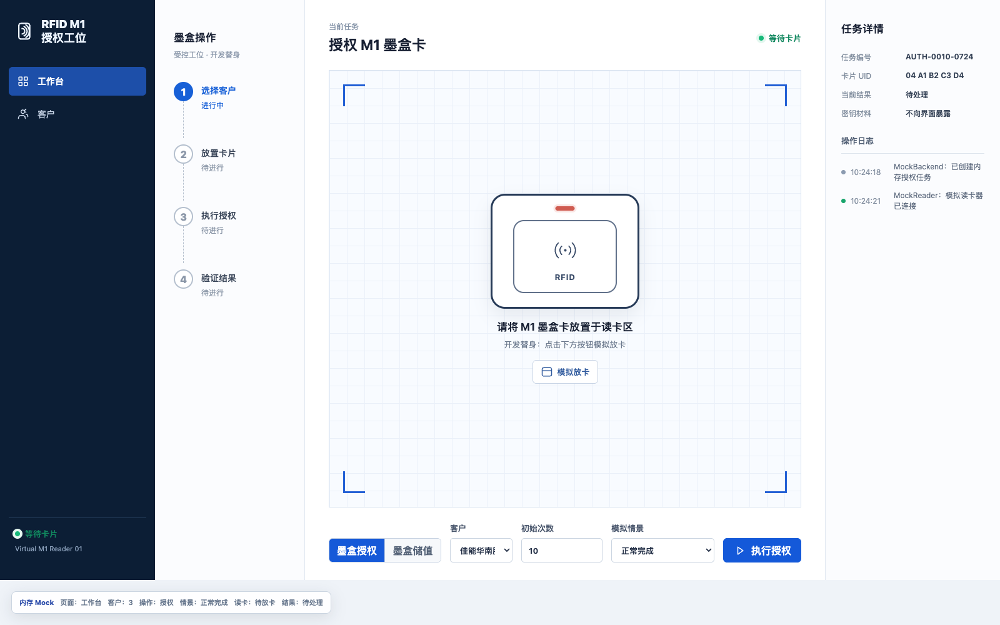
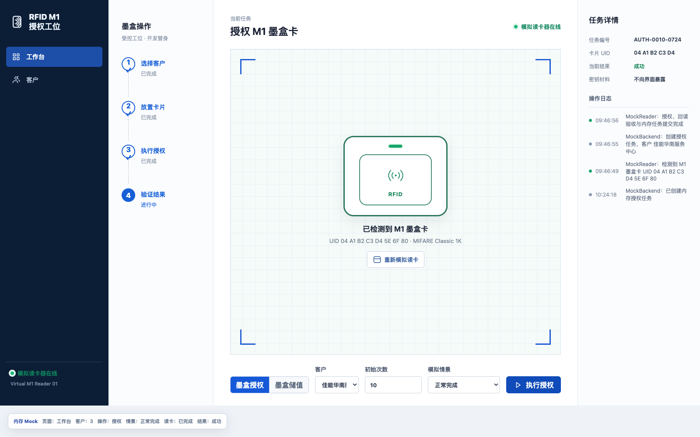
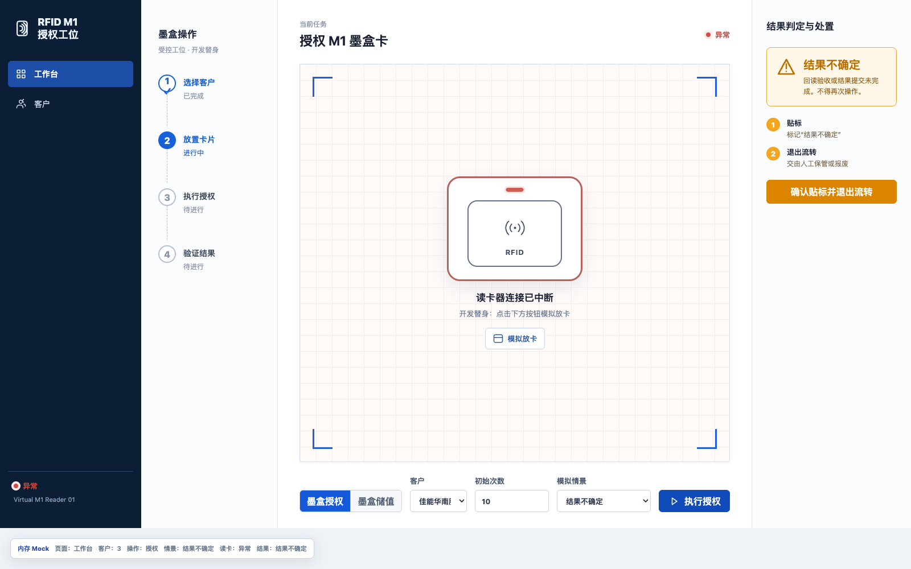
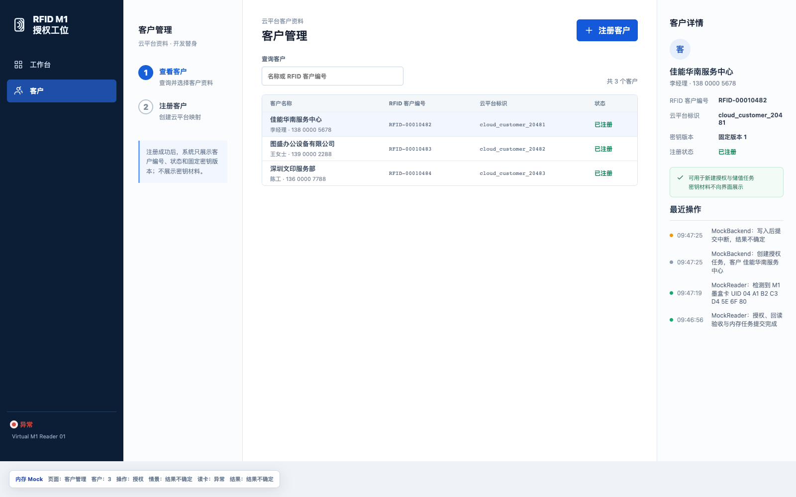

# 桌面端原型与后端接口清单

## 1. 文档目的

本文在 tickets 实施前统一两类输入：

- 已选桌面端 A「引导工作台」的视觉与交互参考；
- 桌面端业务闭环所需的云平台依赖、RFID 后端接口和喷码机配置接口。

接口字段是业务契约级字段，不是最终 OpenAPI 定义。已确认的 RFID 路径可直接进入后端设计；标注“待外部契约确认”的项目必须在对应真实接口 ticket 开始前，由云平台或喷码机团队提供实际路径、认证、字段和错误码。

## 2. 桌面端原型截图

截图于 2026-08-25 使用 1600 × 1000 浏览器视口，从 `prototype/` 的实际运行页面截取。页面明确显示“内存 Mock”；它只证明界面层级与交互状态，不证明 Electron、后端、串口或真实设备已经实现。

截图采集早于本次任务接口精简，仅继续作为 A「引导工作台」结构参考；“任务编号”等旧截图文案不再属于当前接口契约，当前文案以 `prototype/` 源码及本文第 5-6 节为准。

### 2.1 工作台：等待放置墨盒

### 2.2 工作台：授权成功

### 2.3 工作台：结果不确定

该状态必须与普通失败区分。不可逆写入或加值可能已经发生，但无法取得可信本地验收结果时，不得再次操作；墨盒必须贴标并退出流转。

### 2.4 客户管理

界面只展示客户资料、RFID 客户编号、固定密钥版本和注册状态，不展示客户密钥、每卡管理密钥或云平台 token。

## 3. 接口边界总览

| 边界 | 调用方向 | 责任 |
| --- | --- | --- |
| 云平台既有接口 | Electron/RFID 后端 → 云平台 | 操作员登录与会话、客户主数据；本项目不新建账号或客户主数据系统。 |
| RFID 后端接口 | Electron 主进程 → RFID 后端 | 客户映射、密钥库和统一密钥材料获取；不保存授权、储值或喷码机配置结果。 |
| 喷码机受保护配置接口 | Electron 主进程 → 喷码机 | 仅在物理组装/维护模式下原子保存客户授权材料。 |
| 读卡器串口协议 | Electron 主进程 → USB 虚拟串口读卡器 | `AA` 帧、寻卡、认证、块读写和值块操作；不是 HTTP 后端接口。 |

所有桌面端网络与串口调用都在 Electron 主进程完成。React renderer 只提交业务意图并接收脱敏状态。

## 4. 云平台既有接口依赖

这些能力由现有公司云平台提供，不由 RFID 项目重复建设。当前资料没有给出正式路径和字段，因此全部属于真实接口 ticket 的外部输入。

| 编号 | 能力 | 调用方 | 请求关键内容 | 响应关键内容 | 强制约束 | 状态 |
| --- | --- | --- | --- | --- | --- | --- |
| C-01 | 用户名密码登录 | Electron 主进程 | 用户名、密码、桌面端应用标识（若云平台要求） | token、有效期、操作员标识、权限 | token 只存在主进程内存；每次启动重新登录；不得进入 renderer、日志或本地存储。 | 待外部契约确认 |
| C-02 | 会话校验/权限查询 | RFID 后端 | bearer token 或云平台规定的会话凭据 | 操作员标识、会话有效性、授权工位权限 | 每个 RFID 业务接口都必须拒绝失效或无权限会话。 | 待外部契约确认 |
| C-03 | 注销或会话失效 | Electron 主进程/云平台 | 当前会话凭据 | 注销结果 | 无论远端是否提供注销接口，本地都必须立即清除 token；远端路径按云平台能力确定。 | 待外部契约确认 |
| C-04 | 注册客户 | RFID 后端 | 云平台要求的客户资料、调用幂等标识 | `cloud_customer_id`、客户资料或注册结果 | 云平台注册成功而 RFID 本地初始化失败时，必须用原 `cloud_customer_id` 续做，不得重复注册。 | 待外部契约确认 |
| C-05 | 查询客户资料 | RFID 后端 | `cloud_customer_id`、查询或分页条件 | 客户名称、联系人及云平台状态 | RFID 后端只保存必要关联；云平台仍是客户主数据来源。 | 待外部契约确认 |

## 5. RFID 后端：客户与密钥材料接口

以下 3 个路径已经在总方案和桌面端规格中确认。请求/响应字段名可在 OpenAPI 中细化，但不得改变表中的业务语义。

| 编号 | 方法与路径 | 请求关键内容 | 成功响应关键内容 | 业务与安全约束 |
| --- | --- | --- | --- | --- |
| R-01 | `POST /api/rfid/customers` | 云平台所需客户资料；客户端幂等标识（具体形式待 OpenAPI 定义） | `cloud_customer_id`、唯一 32 位 `customer_id`、客户名称、注册状态、`key_version = 1` | 后端调用 C-04；生成 6 字节客户 `Key A` 并加密保存，但响应不返回密钥；重试不得生成第二个映射或密钥；写审计。 |
| R-02 | `GET /api/rfid/customers` | 查询、搜索、分页条件 | 客户列表：`cloud_customer_id`、名称、32 位 `customer_id`、注册状态、固定密钥版本 `1` | 关联 C-05；不得返回明文密钥或密文。 |
| R-03 | `POST /api/rfid/key-material` | `customer_id`、可选 `cartridge_id` | `customer_id`、`key_version = 1`、客户 `Key A`；提供 `cartridge_id` 时同时返回派生的每卡 `Key B` | 仅授权会话可用；`Cache-Control: no-store`；请求/响应体不得进入缓存、日志、埋点或错误上报；不返回工厂根密钥，不创建操作记录。 |

### 5.1 统一错误语义

最终 OpenAPI 至少要让桌面端稳定区分：

| 类别 | 桌面端处置 |
| --- | --- |
| 未登录、token 失效、无授权工位权限 | 终止当前操作；重新登录或提示无权限。 |
| 参数、客户或墨盒编号不合法 | 普通失败；展示不含敏感数据的明确原因。 |
| 取得密钥失败且尚未执行写卡/加值 | 普通失败；可由操作员重新发起。 |
| 不可逆写卡/加值后，读卡器中断或本地回读无法确认 | 结果不确定；不得自动重试业务动作，墨盒贴标并退出流转。 |

## 6. 喷码机配置使用统一密钥材料接口

喷码机配置不再创建后端任务，也不提交配置结果。桌面端调用 R-03 时只传 `customer_id`，取得客户 `Key A` 和固定密钥版本，再与本地布局信息组成喷码机配置材料。后端不接收喷码机序列号、设备结果或配置时间。

删除的 7 个接口为授权创建/完成、储值创建/完成、喷码机配置创建/取材料/提交结果。R-01、R-02 和云平台 C-01 至 C-05 保持不变。

## 7. 喷码机侧必须新增的受保护配置接口

这不是 RFID 后端接口，也不是现有 `RFID功能指令_v1.0.38` 中已有的命令，但它是桌面端完成喷码机本地配置的必要依赖。

| 编号 | 调用方 → 提供方 | 路径/传输 | 请求关键内容 | 成功响应关键内容 | 强制约束 | 状态 |
| --- | --- | --- | --- | --- | --- | --- |
| D-01 | Electron 主进程 → 喷码机 App/固件 | 由喷码机现有通信方式定义 | 喷码机序列号、`customer_id`、`key_version = 1`、客户 `Key A`、业务扇区/块号、布局版本 | 喷码机序列号、密钥版本、布局版本、结果；不得回显密钥 | 仅物理组装/维护模式可调用；认证和防重放；全部字段校验及持久化必须原子完成；`Key A` 进入受保护存储，不得出现在查询接口、普通文件、日志、崩溃报告或调试界面。 | 待喷码机团队定稿 |

喷码机现场运行必须完全离线，不持有 RFID 后端访问权。现场的墨盒认证、喷码准入、喷码成功回调、值块减 1 和失败锁定属于喷码机 App 内部能力，不新增现场后端接口。

## 8. 非 HTTP 设备协议依赖

| 对象 | 协议/动作 | 用途 | 依据 |
| --- | --- | --- | --- |
| USB 虚拟串口读卡器 | `AA` 帧头、递增序号、大端长度、XOR 校验 | Electron 主进程与真实读卡器通信 | `docs/protocol/通用协议规则_v1.0.1.pdf` |
| M1 操作 | 寻卡 `0x1000`、认证 `0x1001`、读块 `0x1002`、写块、值块初始化 `0x1007`、加值 `0x1008`、减值 `0x1009`、读值 `0x100A` | 授权、储值与喷码机离线扣减 | `docs/protocol/RFID功能指令_v1.0.38.pdf` |
| M1 卡布局 | 扇区 1、块 4 至 7、访问控制位、Key A/Key B、值块 | 墨盒身份、权限和可喷码次数 | `docs/design/RFID_M1墨盒授权方案.md` |

具体写块命令值、波特率、超时和设备响应细节必须从随附协议及真实设备验证中确定，不能从原型推断。

## 9. 后端统一非功能要求

- 所有 RFID 接口都校验有效云平台会话和授权工位权限。
- 数据库对 `cloud_customer_id` 和 32 位 `customer_id` 设置唯一约束；后端不保存 `cartridge_id` 或业务任务。
- 客户 `Key A` 和工厂根密钥只以认证加密后的密文持久化；加密主密钥不进入数据库。
- 每卡 `Key B` 由工厂根密钥、固定域 `M1-ADMIN-v1` 和 `cartridge_id` 按总方案派生，不逐卡明文存储。
- 客户注册仍可按云平台规范审计；后端不保存授权、储值或喷码机配置结果。
- 含密钥的响应设置禁止缓存，并从代理、应用日志、埋点和错误上报中排除。
- 错误响应不得包含 token、密钥、完整卡块、堆栈中的敏感请求体或数据库密文。

## 10. 真实接口 tickets 开始前必须取得的外部输入

| 输入 | 阻塞 ticket | 提供方 |
| --- | --- | --- |
| C-01 至 C-05 的正式路径、认证方式、字段、权限声明、错误码和测试账号 | 06、07 | 云平台团队 |
| R-01 至 R-03 的正式 OpenAPI、密钥响应防缓存要求、权限和测试环境 | 07、08 | RFID 后端实施方 |
| D-01 的传输协议、认证、防重放、维护模式判定、原子持久化和错误码 | 13 | 喷码机 App/固件团队 |
| 读卡器波特率、超时、运输状态默认密钥和真实设备响应差异 | 05 | 读卡器与样卡验证 |

这些输入未确认时，可以执行 macOS 阶段的 Electron 壳、A 界面、`MockBackendClient` 和固定字节帧编解码 tickets；不得声称真实云平台、RFID 后端、读卡器或喷码机联调已经完成。
